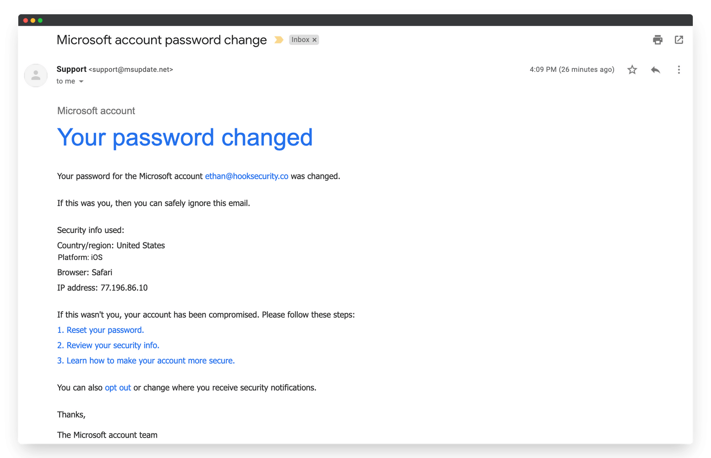
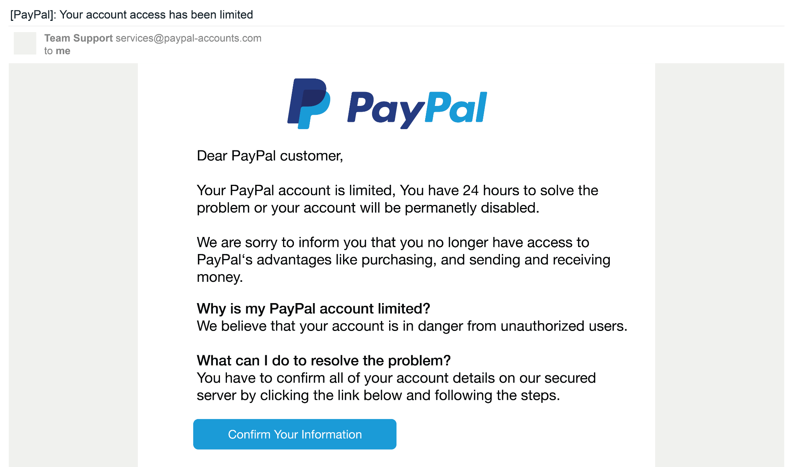

# Internship-Elevatelabs-task2

## Task 2 - Analyze a Phishing Email Sample.

### Objective: 

Identify phishing characteristics in a suspicious email sample.

### Tools: 

Email client or saved email file (text), free online header analyzer.

### Deliverables: 

A report listing phishing indicators found

### Solution:

### 1) Microsoft Phished Email from online source

#### Step 1: Examine sender's email address for spoofing.

Displayed email: `support@msupdate.net`

Remark : Microsoft would use something like `@microsoft.com`, not `@msupdate.net`. So it is suspicious

#### Step 2: Look for Suspicious Email Content 

It Claims the password was changed this is common scare tactic

We can see IP and browser info added to make it look legit which is not needed if legitimate.

This is asking user to act quickly ("your account has been compromised")

#### Step 3: Suspicious Links

Links use like:

  - "Reset your password"
  - 
  - "Learn how to make your account more secure"
  - 
Hovering over the links (not visible in image) might show a **non-Microsoft domain**

#### Step 4: Urgent / Threatening Language

"If this wasn't you, your account has been compromised"

This is designed to panic users into clicking

#### Step 5 :Generic ending

"The Microsoft account team" instead of a named employee

Real emails often include more specific contact details or footer formatting

---

#### Step 6. Summary of Phishing Traits

| Traits                        | Found |
|-------------------------------|-------|
| Spoofed sender address        | Yes |
| Mismatched domain             | Yes |
| Urgent/threatening language   | Yes |
| Generic branding              | Yes |
| Links pushing fast action     | Yes |
| Realistic formatting (to deceive) | Yes |

---

### 2) Paypal Phised Email from online source

#### Step 1: Examine sender's email address for spoofing.

Displayed email: `services@paypal-accounts.com`

Remark : PayPal's real domain is `paypal.com`, not `paypal-accounts.com`.

#### Step 2: Look for Suspicious Email Content 

It Claims the password was changed this is common scare tactic

We can see IP and browser info added to make it look legit which is not needed if legitimate.

This is asking user to act quickly ("your account has been compromised")

#### Step 3: Suspicious Links

Links use like:

  - "Reset your password"
  - 
  - "Learn how to make your account more secure"
  - 
Hovering over the links (not visible in image) might show a **non-Microsoft domain**

#### Step 4: Urgent / Threatening Language

"If this wasn't you, your account has been compromised"

This is designed to panic users into clicking

#### Step 5 :Generic ending

"The Microsoft account team" instead of a named employee

Real emails often include more specific contact details or footer formatting

---

#### Step 6. Summary of Phishing Traits

| Traits                        | Found |
|-------------------------------|-------|
| Spoofed sender address        | Yes |
| Mismatched domain             | Yes |
| Urgent/threatening language   | Yes |
| Generic branding              | Yes |
| Links pushing fast action     | Yes |
| Realistic formatting (to deceive) | Yes |

